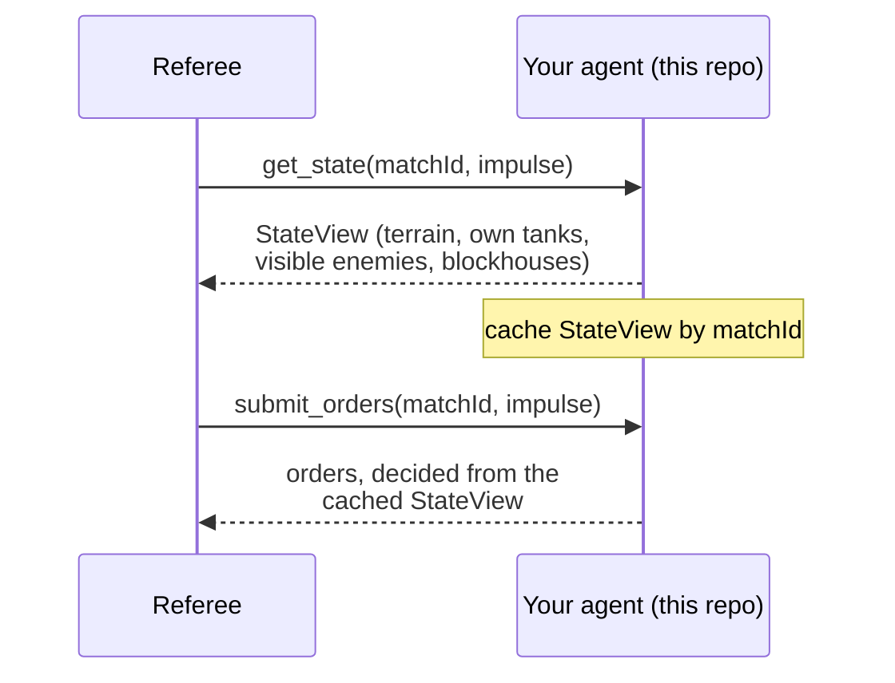

# gismo-agent-typescript

Public repo, created private-first (flips public at a later reveal milestone).

TypeScript starter template for a Gismo competitor agent — an MCP server that talks directly to the
referee (`get_state` / `submit_orders` / `surrender`), with exactly one method left as a stub for you to
fill in. Also hosts two runnable reference agents under `examples/`.

## Table of Contents

- [License](#license)
- [Status](#status)
- [Observability model](#observability-model)
- [Wire encodings](#wire-encodings)
- [The `Strategy` interface](#the-strategy-interface)
- [Running the template](#running-the-template)
- [Reference agents](#reference-agents)
- [Testing](#testing)
- [Repository layout](#repository-layout)

## License

Apache 2.0 — see `LICENSE`.

## Status

Phase 4 complete (see `implementation-roadmap.md` in `gismo-platform`): MCP server template, match-scoped
state cache, `random` and `heuristic` reference agents, unit + conformance-integration tests — mirroring
`gismo-agent-go`. There is no `create-gismo-agent` scaffolder — fork or use this repo directly as a
GitHub template.

## Observability model

Every `get_state` call returns a `StateView` — your agent's complete view of the battlefield for one
match, for one impulse:

| Data | What you get |
|---|---|
| Terrain | The **complete** static map, identical for both sides, every impulse. Never gated. |
| Own tanks | Always, in full. |
| Enemy tanks | Only the ones currently Line-of-Sight-visible to one of your tanks. |
| Blockhouses | Yours always; the enemy's only when Line-of-Sight-visible. |

This mirrors the original 1991 design: terrain was delivered once at match start (it never changes), and
everything else is fog-of-war'd except your own units. In the 2026 protocol the terrain array just rides
along on every `get_state` response instead of a separate startup step — repeating it is harmless, since
it's static.



**Figure 1.** One impulse of the match loop, from the agent's side. Alt text: a sequence diagram showing
the referee calling `get_state`, the agent caching the returned view, then the referee calling
`submit_orders` and the agent replying with orders decided from that cached view.

`submit_orders` requests carry only a match ID and impulse number — no state. That's why every agent
built on this package caches the most recent `StateView` per match ID (see `src/agent/cache.ts`) and
decides orders from that cache; a `submit_orders` call that arrives before any `get_state` for its match
falls back to an empty, always-legal order list (every un-ordered tank simply holds). The cache is shared
across HTTP requests even though the stateless Streamable HTTP transport rebuilds the MCP server per
request (see `src/agent/serve.ts`), so `get_state` and the later `submit_orders` for a match still see
the same view.

## Wire encodings

All enums on the wire are plain integers, matching `gismo-sdk-typescript`'s `mcp` generated types:

| Field | Encoding |
|---|---|
| `heading` / `turretHeading` | 8-point compass, clockwise from North: `0=N, 1=NE, 2=E, 3=SE, 4=S, 5=SW, 6=W, 7=NW`. Y increases southward. |
| `speed` | `0=BackHalf, 1=Halted, 2=AheadHalf, 3=AheadFull`. A tank may change speed by at most 1 step per impulse. |
| `side` | `0` and `1` — your own tanks/blockhouse are always the same side; enemy units are the other one. |
| `terrain[].type` | `1=Forest, 2=Water, 3=Mountain`. Plain (`0`) cells are never sent — an absent cell is Plain. |

**Turn-rate legality.** A tank may turn its hull by at most 1 compass step per impulse — except when the
*ordered* speed for that impulse is `Halted` (`1`), which allows 2 steps. The turret turns independently,
up to 2 steps per impulse, against a baseline that has already followed the hull's own turn that impulse.
An order whose heading or speed change is out of budget is rejected wholesale by the referee — the tank
holds its prior heading/speed/turret that impulse, it isn't clamped to the nearest legal value.
`src/agent/legality.ts` reimplements this math (`turnDistance`, `turnAllowance`, `stepHeadingToward`,
`stepSpeedToward`, `headingToward`) purely from these wire integers, so both reference agents — and your
own `Strategy` — can build legal orders without guessing.

## The `Strategy` interface

```ts
export interface Strategy {
  // Returns the orders to submit for view's impulse. May return an order
  // for any subset of view.ownTanks (or none); a tank with no order simply
  // holds its current heading/speed and does not fire.
  decide(view: mcp.StateView): mcp.TankOrder[];
}
```

This is the only method you implement. Everything else — the MCP tool surface, the match-ID-scoped state
cache, wire encoding/decoding — is handled by the `src/agent` package. `src/main.ts` wires
`new HoldStrategy()` (hold heading/speed, never fire) into `serve`; replace that one line with your own
`Strategy` and your agent is playable.

```ts
await serve(addr, new YourStrategy());
```

## Running the template

```sh
npm ci
npm run build
node dist/src/main.js -addr :8080
```

`-addr` is the address the agent's MCP endpoint listens on. Point the referee (or the conformance
harness) at `http://<host>:8080` for this match. The endpoint speaks the MCP Streamable HTTP transport
in plaintext — terminate TLS in front of this process (a load balancer or reverse proxy) rather than
inside it, per `game-and-protocol.md`'s Secure Transport Requirements.

## Reference agents

Two runnable, always-legal agents live under `examples/`, both built on the same `src/agent` package
(build first with `npm run build`):

- **`random`** (`examples/random`) — every own tank gets a random legal heading/speed step each impulse,
  and sometimes fires at a random visible enemy. Deterministic per seed, useful as a reproducible
  opponent for local testing and CI.

  ```sh
  node dist/examples/random/cmd.js -addr :8081 -seed 1
  ```

- **`heuristic`** (`examples/heuristic`) — deterministic, no randomness: engage the nearest visible
  enemy (turn hull and turret toward it, fire once aligned and in range), or — with no enemy in sight —
  advance toward the nearest Forest cell for concealment.

  ```sh
  node dist/examples/heuristic/cmd.js -addr :8082
  ```

Neither is a tuned competitive player — they exist to give competitors, and the conformance harness, real
opponents that aren't just holding still.

## Testing

```sh
npm test
```

`npm test` runs the `tsc` build (`npm run build`) and then `node --test` over the compiled suite:

- `test/{cache,strategy,legality,validate,server}.test.ts` — the state cache, the `HoldStrategy` default,
  the shared legality helpers, the schema-backed request validators, and the MCP tool surface.
- `test/examples-{random,heuristic}.test.ts` — assert every emitted order is legal, plus each agent's own
  decision logic (nearest-enemy targeting, cover-seeking, determinism).
- `test/conformance.test.ts` — boots real, listening `gismo-agent-typescript` MCP servers over HTTP,
  drives each (the unmodified template and both reference agents) through the fixed
  `get_state → submit_orders → surrender` scenario with a real MCP client, and schema-validates every
  live response against the shared `gismo-contracts/mcp-schema/*.schema.json` files — the same contract
  `gismo-agent-go`'s integration test checks. It resolves `gismo-contracts` via `GISMO_CONTRACTS_DIR`
  (default: the sibling `../gismo-contracts` checkout) and skips if that checkout is absent.

## Repository layout

```
.
├── src/
│   ├── main.ts                # the template: serve + new HoldStrategy()
│   └── agent/                 # MCP server, state cache, Strategy interface, legality + validators
├── examples/
│   ├── random/                # random reference agent + cmd.ts
│   └── heuristic/             # heuristic reference agent + cmd.ts
└── test/                      # unit tests + conformance-over-HTTP test
```
